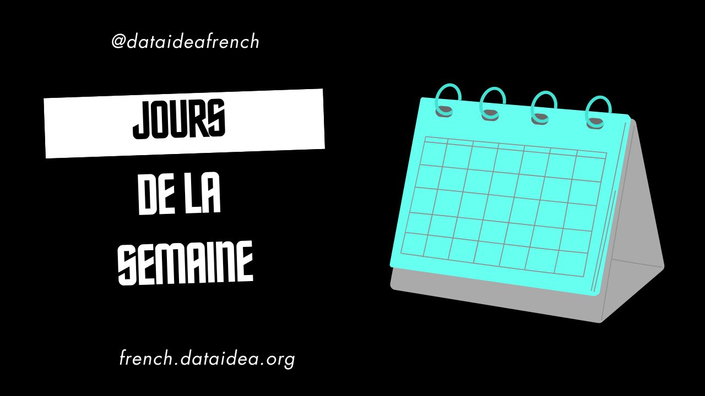

Learning the days of the week in French is a fundamental step for anyone diving into the language. Whether you're planning a trip to a French-speaking country, looking to improve your language skills, or just curious, this guide will help you master the days of the week in French.

## The Days of the Week

In French, the days of the week are known as "les jours de la semaine." Here they are, along with their pronunciations:

1. **Lundi** (Monday) - Pronounced: **lun-dee**
2. **Mardi** (Tuesday) - Pronounced: **mar-dee**
3. **Mercredi** (Wednesday) - Pronounced: **mehr-kruh-dee**
4. **Jeudi** (Thursday) - Pronounced: **zhuh-dee**
5. **Vendredi** (Friday) - Pronounced: **von-druh-dee**
6. **Samedi** (Saturday) - Pronounced: **sam-dee**
7. **Dimanche** (Sunday) - Pronounced: **dee-mahnsh**

## Tips for Learning the Days of the Week

1. **Repetition**: Repetition is key in language learning. Write down the days of the week multiple times. Say them out loud, and try to use them in sentences.

2. **Use Mnemonics**: Create a mnemonic device to help you remember the order. For example, you might think of a story where a character goes through activities each day of the week.

3. **Practice with a Calendar**: Use a French calendar and practice saying the days of the week as you plan your schedule.

4. **Engage with Media**: Listen to French songs, watch movies, or read books that mention the days of the week. This will help you see and hear them in context.

5. **Language Apps**: Use language learning apps like Duolingo, Babbel, or Rosetta Stone to reinforce your learning with interactive exercises.

## Fun Facts About Days of the Week in French

- The French days of the week, like the English ones, are derived from Latin and are associated with celestial bodies and mythological figures.
  - **Lundi** comes from "Luna" (the Moon).
  - **Mardi** comes from "Mars" (the Roman god of war).
  - **Mercredi** comes from "Mercury" (the Roman messenger god).
  - **Jeudi** comes from "Jupiter" (the king of the gods).
  - **Vendredi** comes from "Venus" (the goddess of love).
  - **Samedi** comes from "Saturn" (the Roman god of agriculture).
  - **Dimanche** comes from "Dies Dominicus" (the Day of the Lord).

## Practice Sentences

Here are some simple sentences to help you practice:

- **Aujourd'hui, c'est lundi.** (Today is Monday.)
- **Demain, ce sera mardi.** (Tomorrow will be Tuesday.)
- **Hier, c'était mercredi.** (Yesterday was Wednesday.)
- **Je travaille du lundi au vendredi.** (I work from Monday to Friday.)
- **Le week-end, je me repose le samedi et le dimanche.** (On the weekend, I rest on Saturday and Sunday.)

## Conclusion

Learning the days of the week in French is an excellent way to start your journey into the language. With consistent practice and engagement, you'll have them memorized in no time. Use these tips and resources, and you'll be well on your way to becoming proficient in French. Bon apprentissage! (Happy learning!)

<h2>What's on your mind? Put it in the comments!</h2>
