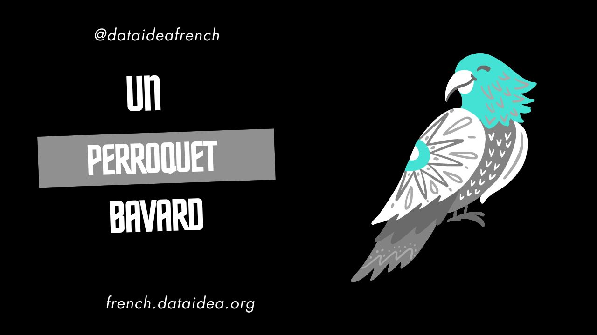

Salut à tous les amateurs de la langue française et aux passionnés des histoires amusantes ! Aujourd'hui, je vous propose une petite histoire drôle pour pratiquer votre français. Laissez-moi vous présenter **"Le Perroquet Bavard"**.

---

## Le Perroquet Bavard

Un jour, un homme entre dans une animalerie et voit un perroquet magnifique avec des plumes multicolores.

« Combien coûte ce perroquet ? » demande l'homme au vendeur.

« Ce perroquet coûte 500 euros, monsieur, » répond le vendeur.

« 500 euros ! Pourquoi est-il si cher ? » s'exclame l'homme.

« Eh bien, ce perroquet parle trois langues : français, anglais et espagnol, » explique le vendeur.

L'homme, très intéressé, décide d'acheter le perroquet. Il ramène l'oiseau chez lui et le met dans une cage bien confortable.

Le lendemain matin, l'homme se lève et entend son perroquet crier : « Il y a un voleur dans la maison ! »

L'homme se précipite hors de sa chambre, paniqué, et regarde partout, mais il ne trouve aucun voleur.

« Que s'est-il passé ? » demande-t-il au perroquet.

Le perroquet répond avec un sourire : « Poisson d'avril ! »

L'homme rit et dit : « Tu m'as bien eu, mais c'est le mois de juillet ! »

Le perroquet réplique : « Je suis un perroquet, pas un calendrier ! »

---

**J'espère que cette petite histoire vous a fait sourire et vous a donné envie de continuer à apprendre le français. À bientôt pour une nouvelle histoire !**

<!-- Newsletter -->

<strong>Don't Miss Any Updates!</strong>

To be among the first to hear about future updates, simply enter your email below, follow us on <a href="https://x.com/dataideaorg"><i class="bi bi-twitter-x"></i>
 (formally Twitter)</a>, or subscribe to our <a href="https://www.youtube.com/@dataideaorg"><i class="bi bi-youtube"></i> YouTube channel</a>.

<iframe src="https://embeds.beehiiv.com/5fc7c425-9c7e-4e08-a514-ad6c22beee74?slim=true" data-test-id="beehiiv-embed" height="52" frameborder="0" scrolling="no" style="margin: 0; border-radius: 0px !important; background-color: transparent; width: 100%;" ></iframe>

<ins class="adsbygoogle"
     style="display:block; text-align:center;"
     data-ad-layout="in-article"
     data-ad-format="fluid"
     data-ad-client="ca-pub-8076040302380238"
     data-ad-slot="8693891310"></ins>

